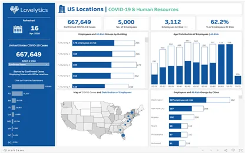

---

title: Let’s Learn About Tableau
date: 2021-07-20T12:40:47Z
draft: false
description: "One of the Top Data Analytics Tools."
image: "tableau.webp"
author: "Chathushi Thalpage"
theme: "full"

ruby: true
fraction: true
fontawesome: true
linkToMarkdown: true
rssFullText: false

toc:
enable: true
auto: true
code:
copy: true

share:
enable: true
------------

If you are interested in learning visual data analytics platforms, this article would be a great match for your interest. Here we discuss about Tableau, which is one of the world’s leading analytical platforms.

**What is Tableau?**

Tableau is an end to end visual analytics platform that allows everyone to review actionable business insights. Also, it is a simple and interactive platform which can be used for powerful data visualization. Besides, Tableau is an in-depth data analytics tool which is capable of combining several data sources such as spreadsheets, databases and cloud data into one program to perform an effective analysis. With Tableau, anyone can visualize and understand data without having any advanced skills in data science.

In simple terms, Tableau can be used to analyze different business case studies. You can collect relevant business requirements and you can visualize them using Tableau. Then it would be easier for you to identify opportunities, risks and solve problems.

**How to get started with Tableau?**

You can download and install the Tableau software by visiting the website https://www.tableau.com

There are several Tableau products such as Tableau Desktop, Tableau Public, Tableau Prep, Tableau Online etc. Among them Tableau Public is the free version for desktops. Also, you can use the Tableau Online version which has been hosted in the cloud.

**What can you do with Tableau?**

1. Accessing the required data sets by connecting to local files (Excel, Text File, Access or other database files) or to a data server (Tableau Server, Google Analytics , Oracle, MySQL, etc.)

2. Having live connections so that any change in the source data will be automatically updated in Tableau.

3. Creating different types of charts based on the data we collected. You can create bar charts, line charts, pie charts, histograms, scatter charts, map charts, tree maps or bullet charts based on the requirements.

4. Adding filters to the charts and work sheets, so that the end user can easily obtain the desired information.

5. Creating dashboards after collecting different views and let the user to compare a variety of data simultaneously.

6. Creating stories using the prepared dashboards.

**Why Tableau is so popular over other analytics tools?**

1. Tableau’s easy to use interface and simple drag and drop help user to focus more on analyzing.

2. Provides deep analytics capabilities to end user.

3. Tableau enables the user to connect numerous types of data sources. This allows organizations to use their existing architecture and minimize the risk of data investments.

4. Data preparation and analysis can be done even by non programmers. No need to have coding skills or advanced data science skills.

5. Helps to transform your data into a powerful dashboard, showing meaningful insights which enable data driven business decisions.

6. User can explore and interact with the visualizations securely through mobiles, tablets or directly in the browser.

7. One of the leading business intelligence platforms that is commonly used in several industries.

**Why is it important to learn Tableau?**

1. Data or business analysts with Tableau certifications are in high demand.

2. Learning Tableau helps you to change your job role (Tableau consultant, Business analyst, Data analyst or Business intelligence analyst).

3. Tableau helps your organization to grow.

4. With Tableau, you can get a good salary.

With the facts you learned from this article, now it would be easier for you to get started with Tableau. If you enjoyed the article, please hit clap icon.

Thank you for reading…