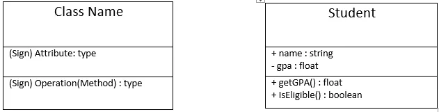
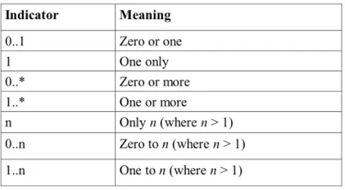
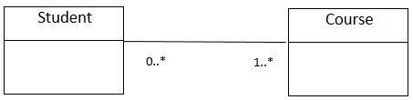
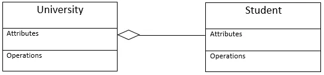
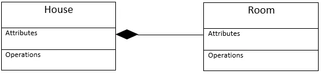
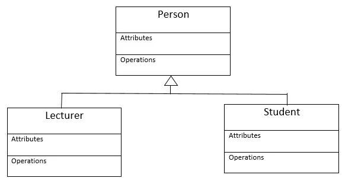

---

title: UML Class Diagrams
date: 2021-09-23T12:40:47Z
draft: false
description: "Learn everything about class diagrams …"
image: "uml_class.webp"
author: "Chathushi Thalpage"
theme: "full"

ruby: true
fraction: true
fontawesome: true
linkToMarkdown: true
rssFullText: false

toc:
enable: true
auto: true
code:
copy: true

share:
enable: true
------------

Since class diagram is the only UML (Unified Modeling Language) diagram which can be mapped directly with object oriented languages, it can be considered as the most common type of diagram that is used in the modeling of object oriented systems. In UML, a class diagram is a static structure diagram and represents the static view of an application. The main objectives of using a class diagram are visualizing, describing and documenting the different aspects of a system. Besides, it can be used for constructing executable code of a software application.

Class diagram shows the relationships between classes, objects, attributes and operations. In that case, first we have to know how to represent these relationships in a class diagram using the most suitable notations.

Here we are going to identify the methods of representing different relationships in a class diagram and at the end of this article you will learn all the necessary basics that will help you to create a class diagram by your own.

## Concepts and notations needed to draw a class diagram

1. **UML Class Notation**

The sign before the attributes and operations represents the access modifiers (public, private or protected) which indicate whether the attributes and methods are hidden from public accessibility or not. This is also called as class visibility. Public, private and protected attributes or operations are denoted by the signs +, - and # respectively.

2. **Association**

Association represents the static relationships between classes. It is represented by a solid line between classes.

3. **Cardinality (multiplicity)**

Cardinality concept indicates the number of instances of one class linked to the instances of another class. This can be simply expressed as a one to one, one to many or many to many relationship. Following notations can be used to represent the cardinality in a class diagram.

eg: Let’s say we have two classes as ‘Student and Course’. A student should do one or more courses, while a course may have zero or more students. We can indicate this scenario as follows.

4. **Aggregation**

Aggregation represents a simple ‘has-a relationship’ between two classes. Simply it says that a whole has parts that belong to it. Although parts can belong to the wholes, they can exist independently. In a class diagram aggregation is represented by an arrow with a hollow diamond. Here arrow points towards the whole class.

eg: Student class has a relationship with the University class. But both University and Student classes can exist independently.

5. **Composition**

Composition represents a strong ‘has-a relationship’ between two classes. It means both whole and its parts cannot exist independently. This is represented by an arrow with a filled diamond and the arrow points towards the whole class.

eg: House made of multiple rooms.

6. **Generalization (Inheritance)**

Concept of generalization represents ‘is-a relationship’ between two classes. Simply it is the relationship between the parent and child classes. An array which points towards the parent class is used to indicate the generalization.

eg: Lecturer and Student are child classes of the Person class.

**How aggregation differs from inheritance?**

In aggregation, the whole class can access only the public functions of the part class. But inheritance allows an inheriting class to access the both public and protected functions of the parent class.

Now we have discussed all the necessary elements that are required to draw a class diagram by your own. The first and most important thing to do when starting to draw a class diagram is identifying the relevant classes and its relationships correctly. In order to do that you have to understand the functionality and the requirements of your software application well.

You can use Lucidchart or Diagrams.net kind of software to draw your class diagrams easily. There are many other software as well. So you can try with these tools when drawing your class diagrams.

Hope now you have learned everything related to class diagrams and try to draw some class digrams by your own.

Thank you very much for reading…